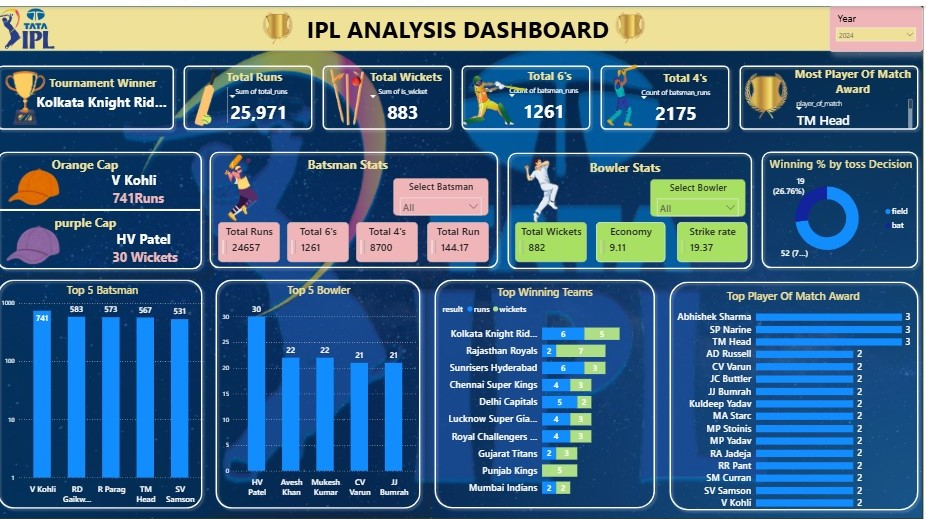

# 🏏 IPL 2024 Data Analysis Dashboard

_Built an interactive Power BI dashboard to analyze the 2024 Indian Premier League (IPL) season, highlighting team performance, batting and bowling statistics, tournament KPIs, and player achievements through interactive visualizations._

---

# 📑 Table of Contents

- <a href="#overview">Overview</a>
- <a href="#business-problem">Business Problem</a>
- <a href="#dataset">Dataset</a>
- <a href="#tools--technologies">Tools & Technologies</a>
- <a href="#project-structure">Project Structure</a>
- <a href="#data-cleaning--preparation">Data Cleaning & Preparation</a>
- <a href="#dashboard-analysis">Dashboard Analysis</a>
- <a href="#key-performance-indicators-kpis">Key Performance Indicators (KPIs)</a>
- <a href="#research-questions--key-findings">Research Questions & Key Findings</a>
- <a href="#business-insights">Business Insights</a>
- <a href="#final-conclusion">Final Conclusion</a>
- <a href="#future-enhancements">Future Enhancements</a>
- <a href="#how-to-run-this-project">How to Run This Project</a>
- <a href="#author--contact">Author & Contact</a>

---

<h2 id="overview">Overview</h2>

This project analyzes the **IPL 2024 season** using Power BI to provide interactive insights into tournament performance, player statistics, batting records, bowling records, and team achievements.

The dashboard enables cricket enthusiasts, analysts, and fans to explore IPL statistics through interactive KPIs, charts, and filters.

The dashboard provides analysis for:

- Tournament Winner
- Total Runs
- Total Wickets
- Total Sixes
- Total Fours
- Orange Cap Winner
- Purple Cap Winner
- Player of the Match Awards
- Top Batsmen
- Top Bowlers
- Winning Teams
- Toss Decision Analysis

---

<h2 id="business-problem">Business Problem</h2>

IPL generates a massive amount of match and player statistics during every season. Analyzing this data manually is time-consuming and difficult.

This project helps answer questions such as:

- Which player scored the most runs?
- Which bowler took the most wickets?
- Which team won the tournament?
- Which teams performed consistently?
- Does winning the toss affect match outcomes?
- Which players received the most Player of the Match awards?

The dashboard transforms raw IPL match data into meaningful and interactive insights.

---

<h2 id="dataset">Dataset</h2>

The project uses publicly available IPL 2024 datasets.

### Dataset Files

- matches.csv
- deliveries.csv
- teams_data.csv
- Category_Icons.xlsx
- Rating_Icon.xlsx

### Dataset Features

| Dataset | Description |
|----------|-------------|
| matches.csv | Match details, teams, venue, toss winner, match winner |
| deliveries.csv | Ball-by-ball data including runs, wickets, batsman and bowler |
| teams_data.csv | Team information |
| Category_Icons.xlsx | Dashboard icons |
| Rating_Icon.xlsx | Rating icons |

---

<h2 id="tools--technologies">Tools & Technologies</h2>

| Technology | Purpose |
|------------|---------|
| Microsoft Power BI | Dashboard Development |
| Power Query | Data Cleaning |
| DAX | KPI Calculations |
| Microsoft Excel | Supporting Data |
| CSV Files | Dataset Source |
| GitHub | Project Hosting |

---

<h2 id="project-structure">Project Structure</h2>

```bash
ipl-2024-data-analysis/
│
├── IPL_Dashboard.jpg
├── README.md
├── matches.csv
├── deliveries.csv.zip
├── teams_data.csv
├── Category_Icons.xlsx
└── Rating_Icon.xlsx
```

---

<h2 id="data-cleaning--preparation">Data Cleaning & Preparation</h2>

Before building the dashboard, the following preprocessing steps were performed:

- Removed duplicate records
- Handled missing values
- Standardized team names
- Verified player statistics
- Converted data types
- Built table relationships
- Created DAX measures
- Optimized data model

---

<h2 id="dashboard-analysis">Dashboard Analysis</h2>

# 📊 Dashboard Preview



---

## 🏆 Tournament Overview

The dashboard displays key tournament statistics including:

| KPI | Value |
|-----|------|
| Tournament Winner | Kolkata Knight Riders |
| Total Runs | 25,971 |
| Total Wickets | 883 |
| Total Sixes | 1,261 |
| Total Fours | 2,175 |
| Player of the Match | TM Head |

These KPIs provide a quick summary of the IPL 2024 season.

---

## 🧡 Orange Cap

The dashboard highlights the highest run scorer.

### Winner

- **Virat Kohli**
- **741 Runs**

### Insights

- Highest run scorer of IPL 2024
- Consistent batting performance throughout the tournament

---

## 💜 Purple Cap

The dashboard identifies the highest wicket taker.

### Winner

- **Harshal Patel**
- **30 Wickets**

### Insights

- Most successful bowler of the tournament
- Played a key role in restricting opposition teams

---

## 🏏 Batsman Statistics

Users can select any batsman using the interactive slicer.

The dashboard displays:

- Total Runs
- Total Sixes
- Total Fours
- Strike Rate

### Findings

- Compare batting performance across players.
- Analyze scoring ability and strike rate.

---

## 🎯 Bowler Statistics

Users can select any bowler to view:

- Total Wickets
- Economy Rate
- Strike Rate

### Findings

- Compare bowling efficiency.
- Identify the most effective bowlers.

---

## 📈 Top 5 Batsmen

The bar chart compares the leading run scorers.

### Findings

- Virat Kohli scored the highest runs.
- Top-order batsmen dominated the tournament.
- Useful for player performance comparison.

---

## 🎯 Top 5 Bowlers

The dashboard ranks bowlers by wickets.

### Findings

- Harshal Patel finished with the highest wicket tally.
- Consistent bowling performances influenced match outcomes.

---

## 🏆 Top Winning Teams

This visualization compares teams based on matches won.

### Findings

- Kolkata Knight Riders emerged as tournament champions.
- Rajasthan Royals and Sunrisers Hyderabad were among the top-performing teams.

---

## ⭐ Player of the Match Awards

The dashboard ranks players based on Player of the Match awards.

### Findings

- Highlights players with the greatest impact.
- Demonstrates consistency across matches.

---

## 🪙 Winning % by Toss Decision

A donut chart compares matches won after choosing to:

- Bat First
- Field First

### Findings

- Teams choosing to field first won more matches.
- Toss decisions had a noticeable influence on match outcomes.

---

<h2 id="key-performance-indicators-kpis">Key Performance Indicators (KPIs)</h2>

| KPI | Description |
|-----|-------------|
| Tournament Winner | IPL 2024 Champion |
| Total Runs | Runs scored during the tournament |
| Total Wickets | Wickets taken |
| Total Sixes | Tournament sixes |
| Total Fours | Tournament boundaries |
| Orange Cap | Highest Run Scorer |
| Purple Cap | Highest Wicket Taker |
| Player of the Match | Most impactful player |

---

<h2 id="research-questions--key-findings">Research Questions & Key Findings</h2>

### Research Questions

1. Who won IPL 2024?
2. Who scored the most runs?
3. Who took the most wickets?
4. Which teams won the most matches?
5. How did toss decisions influence results?
6. Which players received the most Player of the Match awards?

---

### Key Findings

- Kolkata Knight Riders won IPL 2024.
- Virat Kohli secured the Orange Cap with 741 runs.
- Harshal Patel won the Purple Cap with 30 wickets.
- Teams choosing to field first won more matches.
- Top-order batsmen dominated tournament scoring.
- Bowling consistency played a crucial role in match victories.

---

<h2 id="business-insights">Business Insights</h2>

## 📌 Team Insights

- Consistent teams maintained higher winning percentages.
- Strong batting and bowling combinations led to better tournament performance.

## 📌 Player Insights

- Individual player contributions significantly influenced match outcomes.
- Orange Cap and Purple Cap winners demonstrated exceptional consistency.

## 📌 Match Insights

- Toss decisions affected winning probability.
- Boundary hitting remained a key factor in scoring.

---

<h2 id="final-conclusion">Final Conclusion</h2>

The IPL 2024 Data Analysis Dashboard successfully transforms match statistics into meaningful insights through interactive Power BI visualizations.

### Project Outcomes

- Analyzed IPL 2024 tournament statistics
- Compared player performances
- Evaluated team success
- Studied batting and bowling trends
- Built an interactive sports analytics dashboard

---

<h2 id="future-enhancements">Future Enhancements</h2>

- Multi-season IPL comparison
- Predictive match analysis
- Win probability models
- Player performance forecasting
- Live IPL data integration
- Power BI Service deployment

---

<h2 id="how-to-run-this-project">How to Run This Project</h2>

1. Clone or download this repository.
2. Open the `.pbix` file using Microsoft Power BI Desktop.
3. Refresh the dataset if required.
4. Explore the dashboard using filters and slicers.

---

<h2 id="author--contact">Author & Contact</h2>

## 👩‍💻 Author

**Pallavi Bodke**

Aspiring Data Analyst | Power BI Developer | Data Visualization Enthusiast

### Contact

- 📧 Email: pallavibodke108@gmail.com
- 💻 GitHub: https://github.com/pallavibodke
- 🔗 LinkedIn: https://linkedin.com/in/pallavi-bodke-210032259

---

# ⭐ Support

If you found this project useful, consider giving it a ⭐ on GitHub.
